# Data model

> Authoritative schema source: `src/lib/db/schema/*.ts`. The
> authoritative Postgres DDL: `src/lib/db/migrations/0000_*.sql` …
> `0017_*.sql` (18 migrations on `main`).
>
> This document covers all 57 Drizzle-exported tables. Of these, 47
> are domain tables (counted in `MIGRATION_DEPLOYMENT.md` § "From-zero
> migration" — drill 1 reports 39 tables; the rest of the surface
> lands across migrations 0009–0016). The remaining 10 are
> NextAuth framework tables (3 in `identity.ts`: `account`,
> `session`, `verification_token`) plus the Drizzle `_journal`
> metadata table that lives outside the public schema.
>
> Where this document disagrees with the schema, the schema wins.
> Edit this file when adding a new table; PRs that add a table
> without updating this doc fail DOC-006 review.

## Conventions

- All tables live in the `public` schema. Migrations are forward-only
  (the system is append-only — see
  [`../production-readiness/MIGRATION_DEPLOYMENT.md`](../production-readiness/MIGRATION_DEPLOYMENT.md)
  § "2026-08-24 incident").
- All primary keys are UUIDv4 unless noted; every table has
  `created_at` / `updated_at` (the `_helpers.ts` `timestamps`
  helper) plus a soft-archive `archived_at` / `archived_by` pair
  where soft-delete makes sense.
- Every foreign key has an explicit `onDelete` policy. The default
  is `restrict`; only `set null` and `cascade` appear when the
  relationship demands them. `set null` is used for actor / uploader
  fields so audit rows survive user lifecycle changes; `cascade` is
  used for one-to-one children of an agency or workspace (settings,
  DEK, entitlement).
- Domain invariants that the application enforces are also
  enforced at the DB level with `CHECK` constraints, named
  `<table>_<rule>`. The application is the primary enforcer; the
  CHECK is the last line of defence.
- Append-only audit tables (`agency_entitlement_change`,
  `platform_audit_event`, `support_access_audit`) carry
  `BEFORE UPDATE / BEFORE DELETE` triggers installed in
  migrations 0009 / 0012 that `RAISE` an exception. The Drizzle
  schema intentionally does not export any `update` / `delete`
  helper for these tables.

## Domain map

The schema is split into the following domains, each with its own
schema file under `src/lib/db/schema/`. Mermaid sketch below;
the table-by-table inventory follows.

```mermaid
erDiagram
  agency ||--o{ workspace : owns
  agency ||--o{ agency_membership : has
  agency ||--|| agency_entitlement : has
  agency ||--|| agency_social_dek : has
  agency ||--o{ agency_social_provider_config : has
  agency ||--o{ ai_feature_setting : has
  agency ||--o{ ai_provider_secret : has
  workspace ||--o{ workspace_membership : has
  workspace ||--o{ workspace_settings : has
  workspace ||--o{ content_item : produces
  workspace ||--o{ campaign : plans
  workspace ||--o{ content_pillar : plans
  workspace ||--o{ content_template : plans
  workspace ||--o{ social_channel : publishes
  workspace ||--o{ brand_asset : stores
  workspace ||--o{ brand_voice_rule : stores
  workspace ||--o{ brand_publishing_rule : stores
  workspace ||--o{ brand_linked_resource : stores
  user ||--o{ account : auth
  user ||--o{ session : auth
  user ||--o{ comment : writes
  user ||--o{ notification : receives
  user ||--o{ ai_usage_event : triggers
  user ||--o{ content_assignment : receives
  content_item ||--o{ content_item_channel : targets
  content_item ||--o{ content_assignment : "assigned to"
  content_item ||--o{ delivery_version : ships
  content_item ||--o{ comment : discussed
  content_item ||--o{ approval_request : reviewed
  content_item_channel ||--|| publication_record : publishes
  social_channel ||--o| social_connection : "linked to"
  social_channel ||--o{ social_profile_daily_metric : measures
  social_connection ||--o{ social_oauth_state : "authorised by"
  content_item ||--o{ notification : "triggers"
  outbox_event ||--o{ notification : produces
  platform_administrator }o--|| user : "global grant"
  agency_entitlement_change }o--|| agency : "audit log for"
  platform_audit_event }o--|| user : "actor"
  support_access_request }o--|| agency : "targets"
  support_access_grant }o--|| support_access_request : "produced by"
  support_access_audit }o--|| support_access_grant : "authorised by"
  rate_limit_event }o--|| user : "scoped by"
  security_audit_event }o--|| user : "actor"
```

## Table inventory

The columns listed are the public, non-`created_at` / `updated_at`
columns most operators need. The full column set lives in the
schema file named in each row.

### Identity and tenancy (`identity.ts`, `workspaces.ts`)

| Table                           | Purpose                                                                                          | Key columns                                                                                                                                                                                         | FKs                                          | Indexes                                                                                                    | Schema file     |
| ------------------------------- | ------------------------------------------------------------------------------------------------ | --------------------------------------------------------------------------------------------------------------------------------------------------------------------------------------------------- | -------------------------------------------- | ---------------------------------------------------------------------------------------------------------- | --------------- |
| `user`                          | Human (or service) identity. One row per NextAuth subject.                                       | `id`, `email` (citext unique), `displayName`, `role` (app-level), `passwordHash` (null for OAuth)                                                                                                   | (self-references via memberships)            | `user_email_lower_unique`                                                                                  | `identity.ts`   |
| `agency`                        | The tenancy root. One row per customer organization. Multi-agency since M1.7 (was singleton).    | `id`, `name`, `slug` (citext unique), `locale`, `timezone`, `bootstrapCompletedAt`                                                                                                                  | (rooted; everything else hangs off this)     | `agency_slug_unique`                                                                                       | `identity.ts`   |
| `agency_membership`             | User ⇄ agency link. `isAgencyAdmin = true` grants full access without a workspace role row.      | `agencyId`, `userId`, `status` (active/inactive/…), `isAgencyAdmin`                                                                                                                                 | `agencies`, `users`                          | `(agencyId, userId)` unique, `(userId)`                                                                    | `identity.ts`   |
| `bootstrap_lock`                | One row per agency that completed first-admin setup. Idempotency lock.                           | `agencyId` (PK), `completedBy`, `completedAt`                                                                                                                                                       | `agencies`, `users`                          | PK on `agencyId`                                                                                           | `identity.ts`   |
| `platform_administrator`        | Global platform-level authority. Separate from agency admin. One row per user, soft-revocable.   | `userId` (PK), `role` (platform_owner / agency_operator / platform_auditor / support_operator), `revokedAt`                                                                                         | `users` (granted + grantedBy)                | `(role, updatedAt) WHERE revokedAt IS NULL`                                                                | `identity.ts`   |
| `account` (NextAuth)            | OAuth account rows from the NextAuth Drizzle adapter. One row per (provider, providerAccountId). | `userId`, `type`, `provider`, `providerAccountId`, `access_token`, `refresh_token`                                                                                                                  | `users`                                      | `(provider, providerAccountId)` unique, `(userId)`                                                         | `identity.ts`   |
| `session` (NextAuth)            | Server-side session table (NextAuth Drizzle adapter). Cookie is signed; this row is optional.    | `sessionToken` (PK), `userId`, `expires`                                                                                                                                                            | `users`                                      | PK on `sessionToken`                                                                                       | `identity.ts`   |
| `verification_token` (NextAuth) | Magic-link / email verification token.                                                           | `identifier`, `token`, `expires`                                                                                                                                                                    | (none)                                       | `(identifier, token)` unique                                                                               | `identity.ts`   |
| `workspace`                     | A brand inside an agency. The unit of content production + access.                               | `id`, `agencyId`, `name`, `slug` (per-agency unique), `timezone`, `status`                                                                                                                          | `agencies`, `users` (createdBy)              | `(agencyId, lower(slug))` unique, `(agencyId)`; `CHECK` on slug format                                     | `workspaces.ts` |
| `workspace_settings`            | One-to-one child of `workspace`. Per-workspace defaults (reviewers, lead days, monthly target).  | `workspaceId` (PK), `defaultDesignerId`, `defaultContentReviewerId`, `defaultInternalCreativeReviewerId`, `defaultClientReviewerId`, `approvalMode`, `*LeadDays`, `monthlyTarget`, `channelTargets` | `workspaces`, `users` (4× defaultReviewer)   | PK on `workspaceId`                                                                                        | `workspaces.ts` |
| `workspace_membership`          | User ⇄ workspace link for non-admin users. Agency admins bypass this.                            | `id`, `workspaceId`, `userId`, `status`                                                                                                                                                             | `workspaces`, `users`                        | `(workspaceId, userId)` unique, `(userId)`                                                                 | `workspaces.ts` |
| `workspace_membership_role`     | One row per (membership, role). A user can hold multiple roles.                                  | `workspaceMembershipId`, `role` (workspace_manager / content_planner / designer / internal_reviewer / publisher / viewer / client_reviewer)                                                         | `workspace_membership`                       | PK on `(workspaceMembershipId, role)`                                                                      | `workspaces.ts` |
| `invitation`                    | Pending email invite. Token is hashed; never stored raw.                                         | `id`, `agencyId`, `email`, `tokenHash`, `status`, `grantsAgencyAdmin`, `expiresAt`                                                                                                                  | `agencies`, `users` (invitedBy / acceptedBy) | `(tokenHash)` unique, `(agencyId, email)` index, `(agencyId, email) WHERE status='pending'` partial unique | `workspaces.ts` |
| `invitation_workspace_role`     | The workspace roles granted by an invitation. One row per (invite, ws, role).                    | `invitationId`, `workspaceId`, `role`                                                                                                                                                               | `invitations`, `workspaces`                  | PK on `(invitationId, workspaceId, role)`                                                                  | `workspaces.ts` |

### Brand and channels (`channels.ts`, `brand-kit.ts`)

| Table                   | Purpose                                                                                  | Key columns                                                                                                                                                               | FKs                                | Indexes                                                                                             | Schema file    |
| ----------------------- | ---------------------------------------------------------------------------------------- | ------------------------------------------------------------------------------------------------------------------------------------------------------------------------- | ---------------------------------- | --------------------------------------------------------------------------------------------------- | -------------- |
| `social_channel`        | A social account the workspace publishes to. Optionally linked to a `social_connection`. | `id`, `workspaceId`, `platform` (enum), `accountName`, `handle`, `url`, `socialConnectionId?`, `connectionStatus` (manual/connected/needs_reauth/sync_error/disconnected) | `workspaces`, `users` (archivedBy) | `(workspaceId)`, `(workspaceId) WHERE archived_at IS NULL`, `CHECK` on URL https, `CHECK` on status | `channels.ts`  |
| `brand_asset`           | Logo, color swatch, font, reference. Soft-archived.                                      | `id`, `workspaceId`, `kind` (logo/color/font/guideline/reference/other), `name`, `value` (jsonb), `storagePath?`, `externalUrl?`                                          | `workspaces`, `users` (createdBy)  | `(workspaceId)`, `CHECK` on `kind`                                                                  | `channels.ts`  |
| `brand_voice_rule`      | Tone / do / don't rule. Soft-archived.                                                   | `id`, `workspaceId`, `ruleType` (tone/do/dont), `content`, `sortOrder` (text for sortable insertion)                                                                      | `workspaces`, `users` (createdBy)  | `(workspaceId, sortOrder)`, `CHECK` on `ruleType`                                                   | `channels.ts`  |
| `brand_publishing_rule` | Editorial guardrails (alt-text, hashtag, compliance, channel, general). Soft-archived.   | `id`, `workspaceId`, `ruleType` (alt_text/hashtag/compliance/channel/general), `title`, `content`, `sortOrder` (int)                                                      | `workspaces`, `users` (createdBy)  | `(workspaceId, sortOrder)`, `CHECK` on `ruleType`                                                   | `brand-kit.ts` |
| `brand_linked_resource` | External link to a design / asset library (Drive, Figma, Canva, Dropbox, other).         | `id`, `workspaceId`, `provider` (google_drive/figma/canva/dropbox/other), `name`, `url`, `description?`                                                                   | `workspaces`, `users` (createdBy)  | `(workspaceId)`, `CHECK` on `provider`, `CHECK` on `url` (https)                                    | `brand-kit.ts` |

### Content production (`content.ts`, `planning.ts`)

| Table                  | Purpose                                                                                               | Key columns                                                                                                                                                                                                                                     | FKs                                                                         | Indexes                                                                                                                                                                                                           | Schema file   |
| ---------------------- | ----------------------------------------------------------------------------------------------------- | ----------------------------------------------------------------------------------------------------------------------------------------------------------------------------------------------------------------------------------------------- | --------------------------------------------------------------------------- | ----------------------------------------------------------------------------------------------------------------------------------------------------------------------------------------------------------------- | ------------- |
| `content_item`         | A single piece of content being produced. The core entity.                                            | `id`, `workspaceId`, `campaignId?`, `contentPillarId?`, `title`, `format` (enum), `brief`, `formatPayload` (jsonb), `plannedPublishAt`, `status` (enum), `changeRequestGate?`, `priority`, `*OwnerId`, `approvedDeliveryVersionId?`, `revision` | `workspaces`, `campaigns`, `content_pillars`, `users` (owner + 4 reviewers) | `(workspaceId, plannedPublishAt)`, `(workspaceId, status)`, `(designerId, status) WHERE archived_at IS NULL`, `(contentOwnerId, status) WHERE archived_at IS NULL`; 5 `CHECK` constraints on status/gate/priority | `content.ts`  |
| `content_item_channel` | The cross-product of a content item and the channels it targets. Holds per-channel overrides.         | `id`, `contentItemId`, `socialChannelId`, `plannedPublishAtOverride?`, `caption`, `callToAction`, `hashtags[]`, `platformPayload` (jsonb)                                                                                                       | `content_items`, `social_channels`                                          | `(contentItemId, socialChannelId)` unique, `(socialChannelId, plannedPublishAtOverride)`                                                                                                                          | `content.ts`  |
| `content_assignment`   | Historical record of who was assigned to what on a content item (current IDs also on `content_item`). | `id`, `contentItemId`, `assignmentType` (owner/designer/…), `userId`, `assignedBy?`, `active`, `assignedAt`, `releasedAt?`                                                                                                                      | `content_items`, `users`                                                    | `(contentItemId)`, `(userId, active)`, `CHECK` on `assignmentType`                                                                                                                                                | `content.ts`  |
| `campaign`             | A workspace-scoped planning container. Groups content items by objective + date range.                | `id`, `workspaceId`, `name`, `objective?`, `description?`, `startDate?`, `endDate?`, `ownerId?`, `coverColor?`, `status` (draft/active/completed/archived)                                                                                      | `workspaces`, `users` (owner, createdBy)                                    | `(workspaceId, status)`, `CHECK` on `status`                                                                                                                                                                      | `planning.ts` |
| `content_pillar`       | A content theme (e.g. "Product Education"). Partial-unique name per active workspace.                 | `id`, `workspaceId`, `name`, `color?`, `description?`                                                                                                                                                                                           | `workspaces`, `users` (createdBy)                                           | `(workspaceId, lower(name)) WHERE archived_at IS NULL` unique, `(workspaceId)`                                                                                                                                    | `planning.ts` |
| `content_template`     | A reusable starting point for a new content item.                                                     | `id`, `workspaceId`, `name`, `format`, `defaultChannelIds[]`, `contentPillarId?`, `briefTemplate?`, `formatPayload?`, `defaultDesignerId?`, `defaultReviewerId?`, `relativeScheduleRule?`                                                       | `workspaces`, `content_pillars`, `users`                                    | `(workspaceId, lower(name)) WHERE archived_at IS NULL` unique, `(workspaceId)`                                                                                                                                    | `planning.ts` |

### Deliveries and approvals (`deliveries.ts`)

| Table               | Purpose                                                                                      | Key columns                                                                                                                                                                                                               | FKs                                           | Indexes                                                                                  | Schema file     |
| ------------------- | -------------------------------------------------------------------------------------------- | ------------------------------------------------------------------------------------------------------------------------------------------------------------------------------------------------------------------------- | --------------------------------------------- | ---------------------------------------------------------------------------------------- | --------------- |
| `delivery_version`  | A single designer's drop of a content item. Version numbers are allocated under row lock.    | `id`, `contentItemId`, `versionNumber` (>0), `description`, `designerNote?`, `includedFormats[]`, `submittedBy`, `submittedAt`, `isFinalApproved`                                                                         | `content_items`, `users` (submittedBy)        | `(contentItemId, versionNumber)` unique, `CHECK versionNumber > 0`                       | `deliveries.ts` |
| `delivery_link`     | A preview / source link attached to a delivery version. Must be https.                       | `id`, `deliveryVersionId`, `provider` (figma/dropbox/google_drive/canva/other), `label`, `url`, `isPreview`                                                                                                               | `delivery_versions`                           | `(deliveryVersionId)`, `CHECK url ~ '^https://'`                                         | `deliveries.ts` |
| `approval_request`  | A pending ask for review at a given gate. Single-effective-decision invariant.               | `id`, `contentItemId`, `gate` (enum), `deliveryVersionId?`, `requestedBy`, `requestedAt`, `dueAt?`, `status` (pending/approved/changes_requested/rejected/cancelled), `sequence`, `invalidatedAt?`, `invalidationReason?` | `content_items`, `delivery_versions`, `users` | `(contentItemId, status)`, `(contentItemId, gate) WHERE status='pending'` partial unique | `deliveries.ts` |
| `approval_decision` | A reviewer's decision on an approval request. Changes-requested requires non-empty feedback. | `id`, `approvalRequestId`, `reviewerId`, `decision`, `feedback?`, `decidedAt`                                                                                                                                             | `approval_requests`, `users` (reviewer)       | `(approvalRequestId)`, `CHECK changes_requested ⇒ feedback IS NOT NULL`                  | `deliveries.ts` |

### Publishing (`publishing.ts`)

| Table                | Purpose                                                                                    | Key columns                                                                                                                                                                                 | FKs                                          | Indexes                                                                                                                                                                                                | Schema file     |
| -------------------- | ------------------------------------------------------------------------------------------ | ------------------------------------------------------------------------------------------------------------------------------------------------------------------------------------------- | -------------------------------------------- | ------------------------------------------------------------------------------------------------------------------------------------------------------------------------------------------------------ | --------------- |
| `publication_record` | One row per `content_item_channel` recording the publish outcome. Six `CHECK` constraints. | `id`, `contentItemChannelId`, `status` (pending/published/skipped/failed), `actualPublishedAt?`, `publishedUrl?`, `publisherId?`, `note?`, `failureReason?`, `attemptNumber`, `verifiedAt?` | `content_item_channels`, `users` (publisher) | `(contentItemChannelId)` unique, `(status)`; CHECKs on published-needs-(url,time,publisher), skipped-needs-note, failed-needs-reason, pending-clears-fields, published-url-https, attempt-non-negative | `publishing.ts` |

### Discussion and attachments (`discussions.ts`)

| Table             | Purpose                                                                                      | Key columns                                                                                                                                                                                   | FKs                                                | Indexes                                                            | Schema file      |
| ----------------- | -------------------------------------------------------------------------------------------- | --------------------------------------------------------------------------------------------------------------------------------------------------------------------------------------------- | -------------------------------------------------- | ------------------------------------------------------------------ | ---------------- |
| `comment`         | A discussion thread entry. Reply visibility ≤ parent visibility (enforced in service layer). | `id`, `contentItemId`, `parentCommentId?`, `authorId`, `visibility` (internal/client), `label` (general/question/blocker/…), `body`, `resolvedAt?`, `resolvedBy?`, `editedAt?`                | `content_items`, `users` (author, resolvedBy)      | `(contentItemId, createdAt)`, `(authorId)`, `CHECK body non-empty` | `discussions.ts` |
| `comment_mention` | A user ping inside a comment.                                                                | `commentId`, `mentionedUserId`, `createdAt`                                                                                                                                                   | `comments`, `users`                                | PK on `(commentId, mentionedUserId)`                               | `discussions.ts` |
| `attachment`      | An uploaded file attached to a content item, comment, or delivery.                           | `id`, `workspaceId`, `contentItemId?`, `commentId?`, `deliveryVersionId?`, `kind` (reference/preview/logo/brief/comment), `storagePath`, `originalName`, `mimeType`, `byteSize`, `uploadedBy` | `workspaces`, `content_items`, `comments`, `users` | `(workspaceId)`, `(contentItemId)`, `CHECK` on `kind`              | `discussions.ts` |

### Notifications, outbox, activity (`notifications.ts`)

| Table                     | Purpose                                                                            | Key columns                                                                                                                       | FKs                                    | Indexes                                                             | Schema file        |
| ------------------------- | ---------------------------------------------------------------------------------- | --------------------------------------------------------------------------------------------------------------------------------- | -------------------------------------- | ------------------------------------------------------------------- | ------------------ |
| `notification`            | An in-app notification delivered to a user.                                        | `id`, `userId`, `workspaceId?`, `contentItemId?`, `kind` (enum), `title`, `body`, `actionUrl?`, `readAt?`                         | `users`, `workspaces`, `content_items` | `(userId, readAt, createdAt DESC)`, `(workspaceId, createdAt DESC)` | `notifications.ts` |
| `notification_preference` | Per-(user, kind) preferences for in-app, email, digest.                            | `userId`, `kind`, `inAppEnabled`, `emailEnabled`, `digestEnabled`                                                                 | `users`                                | PK on `(userId, kind)`                                              | `notifications.ts` |
| `outbox_event`            | The transactional outbox. Business writes + outbox row in the same DB transaction. | `id`, `eventType`, `aggregateType`, `aggregateId`, `payload` (jsonb), `availableAt`, `processedAt?`, `attemptCount`, `lastError?` | (none — generic by design)             | `(availableAt) WHERE processed_at IS NULL`                          | `notifications.ts` |
| `activity_event`          | Per-workspace activity feed entry. Tenant-scoped (vs. `platform_audit_event`).     | `id`, `workspaceId`, `contentItemId?`, `actorId?`, `kind`, `summary`, `beforeData?`, `afterData?`, `metadata?`                    | `workspaces`, `content_items`, `users` | `(workspaceId, createdAt DESC)`, `(contentItemId)`                  | `notifications.ts` |

### Social and analytics (`social-analytics.ts`, `social-dek.ts`, `provider-config.ts`)

| Table                           | Purpose                                                                           | Key columns                                                                                                                                                                                                                                                                                                                                                 | FKs                                            | Indexes                                                                                                                                                                        | Schema file           |
| ------------------------------- | --------------------------------------------------------------------------------- | ----------------------------------------------------------------------------------------------------------------------------------------------------------------------------------------------------------------------------------------------------------------------------------------------------------------------------------------------------------- | ---------------------------------------------- | ------------------------------------------------------------------------------------------------------------------------------------------------------------------------------ | --------------------- |
| `social_connection`             | A (workspace, provider, provider_subject_id) triple. Sealed credentials envelope. | `id`, `workspaceId`, `provider` (meta/tiktok), `providerSubjectId`, `status` (pending_selection/active/needs_reauth/error/revoked), `scopes[]`, `credentialsCiphertext`, `credentialsIv`, `credentialsTag`, `credentialsKeyVersion`, `accessTokenExpiresAt?`, `refreshTokenExpiresAt?`, `metadata` (jsonb), `connectedBy`, `lastRefreshedAt?`, `revokedAt?` | `workspaces`, `users` (connectedBy)            | `(workspaceId, status)`, `CHECK` on `provider`, `CHECK` on `status`; partial-unique on `(workspaceId, provider, providerSubjectId) WHERE revokedAt IS NULL` is declared in SQL | `social-analytics.ts` |
| `social_oauth_state`            | One-time CSRF bag. Stores sha256(state), never the raw value.                     | `id`, `stateDigest`, `provider` (meta/tiktok), `workspaceId`, `actorId`, `returnPath`, `expiresAt`, `consumedAt?`                                                                                                                                                                                                                                           | `workspaces`, `users`                          | unique on `stateDigest`, `CHECK` on `provider`, `CHECK` on `returnPath` (`/app/w/[a-z0-9-]+/channels`)                                                                         | `social-analytics.ts` |
| `social_profile_daily_metric`   | One row per (channel, calendar day in workspace timezone). Upsert key.            | `id`, `socialChannelId`, `metricDate`, `observedAt`, `followerCount`, `followingCount`, `mediaCount`, `likesCount`, `reach`, `views`, `engagedAccounts`, `interactions`, `providerApiVersion`, `providerRequestId?`, `responseHash`, `sourceMetadata` (jsonb)                                                                                               | `social_channels`                              | `(socialChannelId, metricDate)` unique, `(socialChannelId, observedAt)`; CHECK counts non-negative                                                                             | `social-analytics.ts` |
| `agency_social_dek`             | The per-agency DEK envelope. AES-256-GCM with the platform KEK.                   | `agencyId` (PK), `dekCiphertext` (bytea), `dekIv` (bytea), `dekTag` (bytea), `dekKeyVersion`, `enabledAt`, `enabledBy`, `lastRotatedAt?`, `lastRotatedBy?`, `rotationReason?`                                                                                                                                                                               | `agencies`, `users` (enabledBy, lastRotatedBy) | PK on `agencyId`, `(dekKeyVersion)`                                                                                                                                            | `social-dek.ts`       |
| `agency_social_provider_config` | The per-agency provider config (M4.6 hard cutover from env). Sealed app secret.   | `id`, `agencyId`, `provider` (meta/tiktok), `appId`, `appSecretCiphertext`, `appSecretIv`, `appSecretTag`, `appSecretKeyVersion`, `loginConfigId?`, `graphApiVersion?`, `enabled`, `configuredBy`, `lastTestedAt?`, `lastTestedOk?`, `lastTestErrorCode?`, `lastTestErrorAt?`                                                                               | `agencies`, `users` (configuredBy)             | `(agencyId, provider)` unique, `(agencyId)`; CHECK on `provider`, CHECK on `appSecretKeyVersion` 1..32767                                                                      | `provider-config.ts`  |

### AI (`ai.ts`)

| Table                   | Purpose                                                                                                       | Key columns                                                                                                                                                                                | FKs                                                | Indexes                                                                                   | Schema file                                                                   |
| ----------------------- | ------------------------------------------------------------------------------------------------------------- | ------------------------------------------------------------------------------------------------------------------------------------------------------------------------------------------ | -------------------------------------------------- | ----------------------------------------------------------------------------------------- | ----------------------------------------------------------------------------- |
| `ai_feature_setting`    | Per-agency AI feature flag + capability allowlist. One row per agency.                                        | `agencyId` (PK), `enabled`, `model`, `enabledCapabilities[]`, `keySource` (environment/managed_secret), `maskedKeySuffix?`, `lastConnectionTestAt?`, `lastConnectionTestOk?`, `updatedBy?` | `agencies`, `users` (updatedBy)                    | PK on `agencyId`                                                                          | `ai.ts`                                                                       |
| `ai_usage_event`        | One row per AI generation call. Append-only.                                                                  | `id`, `agencyId`, `workspaceId`, `contentItemId?`, `userId`, `capability`, `model`, `inputTokens?`, `outputTokens?`, `contextManifest` (jsonb), `requestId`, `succeeded`, `createdAt`      | `agencies`, `workspaces`, `content_items`, `users` | `(workspaceId, createdAt DESC)`, `(agencyId, createdAt DESC)`, `(userId, createdAt DESC)` | `ai.ts`                                                                       |
| `ai_provider_secret`    | The per-agency encrypted MiniMax API key. AES-256-GCM with a fresh IV per write.                              | `agencyId` (PK), `ciphertext` (bytea), `keyVersion`, `lastFour`, `rotatedByUserId?`                                                                                                        | `agencies`, `users` (rotatedByUserId)              | PK on `agencyId`                                                                          | `ai.ts`                                                                       |
| `ai_daily_budget_usage` | Per-(agency, user, day) request counter for the daily AI cap. Reconciled atomically with monthly reservation. | `agencyId`, `userId`, `usageDate` (composite PK), `requestCount`, `lastRequestId?`, `lastRecordedAt`                                                                                       | `agencies`, `users`                                | `(agencyId, usageDate DESC)`, CHECK `requestCount >= 0`                                   | `support.ts` (lives in `support.ts` per M3 spec; see MIGRATION_DEPLOYMENT.md) |

### Support access (`support.ts`)

| Table                    | Purpose                                                                                            | Key columns                                                                                                                                                                                                                                                                                         | FKs                                                                                             | Indexes                                                                                                                             | Schema file  |
| ------------------------ | -------------------------------------------------------------------------------------------------- | --------------------------------------------------------------------------------------------------------------------------------------------------------------------------------------------------------------------------------------------------------------------------------------------------- | ----------------------------------------------------------------------------------------------- | ----------------------------------------------------------------------------------------------------------------------------------- | ------------ |
| `support_access_request` | A platform admin's pending ask for tenant access. One per external ticket.                         | `id`, `ticketReference` (unique), `reason`, `targetAgencyId`, `scopeWorkspaceId?`, `scopeMetadataOnly`, `requestedDurationHours` (1..168), `downloadsRequested`, `status` (pending/approved/rejected/cancelled/expired), `requestedByUserId?`, `approvedByUserId?`, `decidedAt?`, `decisionReason?` | `agencies` (target), `workspaces` (scope), `users` (requester, approver)                        | `(ticketReference)` unique, `(targetAgencyId, createdAt DESC)`, `(status, createdAt DESC)`; CHECK on status, CHECK on duration      | `support.ts` |
| `support_access_grant`   | The time-limited authorisation that unlocks a specific scope for a specific platform admin.        | `id`, `requestId` (unique), `targetAgencyId`, `scopeWorkspaceId?`, `scopeMetadataOnly`, `downloadsAllowed`, `approvedByUserId`, `grantedToUserId`, `activatedAt`, `expiresAt`, `revokedAt?`, `revokedByUserId?`, `revokedReason?`                                                                   | `support_access_requests`, `agencies`, `workspaces`, `users` (approvedBy, grantedTo, revokedBy) | `(targetAgencyId, createdAt DESC)`, `(grantedToUserId, expiresAt) WHERE revokedAt IS NULL` partial; CHECK `expiresAt > activatedAt` | `support.ts` |
| `support_access_audit`   | Append-only audit of every object viewed through an active grant. Trigger-forbidden UPDATE/DELETE. | `id` (bigserial), `grantId?`, `actorUserId?`, `targetAgencyId`, `targetType`, `targetId?`, `action`, `outcome` (success/denied/failed), `ip` (inet), `userAgent?`, `requestId?`, `metadata?` (jsonb)                                                                                                | `support_access_grants`, `agencies`, `users`                                                    | `(actorUserId, createdAt DESC)`, `(targetAgencyId, targetType, createdAt DESC)`, `(grantId, createdAt DESC)`, CHECK on `outcome`    | `support.ts` |

### Plans, entitlements, usage (`plans.ts`, `usage.ts`)

| Table                          | Purpose                                                                                               | Key columns                                                                                                                                 | FKs                                   | Indexes                                                                                                             | Schema file |
| ------------------------------ | ----------------------------------------------------------------------------------------------------- | ------------------------------------------------------------------------------------------------------------------------------------------- | ------------------------------------- | ------------------------------------------------------------------------------------------------------------------- | ----------- |
| `platform_plan_template`       | The plan tier catalogue (Starter / Growth / Enterprise / Custom). Soft-archived.                      | `id`, `slug` (unique among non-archived), `name`, `description?`, `defaultLimits` (jsonb; null only for `custom`)                           | (none)                                | `(slug) WHERE archived_at IS NULL` unique, `(archivedAt)`                                                           | `plans.ts`  |
| `agency_entitlement`           | The per-agency entitlement. PK is `agencyId` (1:1).                                                   | `agencyId` (PK), `planTemplateId`, `overrides?` (jsonb), `hardStopPercent` (0..100), `gracePolicy?`, `effectiveSince`                       | `agencies`, `platform_plan_templates` | PK on `agencyId`, `(planTemplateId)`, CHECK `0 <= hardStopPercent <= 100`                                           | `plans.ts`  |
| `agency_entitlement_change`    | Append-only audit of every entitlement mutation. Trigger-forbidden UPDATE/DELETE.                     | `id`, `agencyId`, `actorUserId?`, `before` (jsonb snapshot), `after` (jsonb snapshot), `reason`, `createdAt`                                | `agencies`, `users`                   | `(agencyId, createdAt DESC)`, `(actorUserId, createdAt DESC)`                                                       | `plans.ts`  |
| `agency_usage_threshold_event` | Emitted when a counter crosses 80% / 90% / 100%. Dedupe key is `(agency, resource, level, cycleKey)`. | `id`, `agencyId`, `resource`, `cycleKey` (default `CURRENT_DATE::text`), `percent`, `level` (80/90/100/over_limit), `observedAt`            | `agencies`                            | `(agencyId, resource, level, cycleKey)` unique, `(agencyId, resource, observedAt DESC)`, CHECK `percent >= 0`       | `plans.ts`  |
| `platform_audit_event`         | Append-only platform-level audit (lifecycle, plan, support actions). Trigger-forbidden UPDATE/DELETE. | `id`, `actorUserId?`, `action`, `target` (jsonb `{type, id}`), `before?` (jsonb), `after?` (jsonb), `ip?` (inet), `userAgent?`, `createdAt` | `users` (actor)                       | `(actorUserId, createdAt DESC)`, `(action, createdAt DESC)`, `((target->>'type'), (target->>'id'), createdAt DESC)` | `plans.ts`  |
| `agency_usage_counter`         | Per-(agency, resource) current value. Bigint so storage_bytes + AI token counts don't overflow.       | `agencyId`, `resourceKey`, `currentValue` (bigint, `>= 0`), `lastRecordedAt`, `lastUpdatedAt`, `version` (CAS counter)                      | `agencies`                            | PK on `(agencyId, resourceKey)`, `(agencyId)`, `(agencyId, resourceKey)`, CHECK `currentValue >= 0`                 | `usage.ts`  |

### Security and rate limits (`audit.ts`)

| Table                  | Purpose                                                                               | Key columns                                                                                                                                        | FKs             | Indexes                                                 | Schema file |
| ---------------------- | ------------------------------------------------------------------------------------- | -------------------------------------------------------------------------------------------------------------------------------------------------- | --------------- | ------------------------------------------------------- | ----------- |
| `security_audit_event` | Security-relevant events: bootstrap attempts, invitation accept, password reset, etc. | `id` (bigserial), `actorId?`, `action`, `targetType`, `targetId?`, `outcome` (success/denied/failed), `requestId?`, `ipHash?`, `metadata?` (jsonb) | `users` (actor) | `(actorId, createdAt DESC)`, `(action, createdAt DESC)` | `audit.ts`  |
| `rate_limit_event`     | Per-(scope, subjectHash) timestamp log; the rate-limit service prunes old rows.       | `id` (bigserial), `scope`, `subjectHash`, `occurredAt`                                                                                             | (none)          | `(scope, subjectHash, occurredAt)`                      | `audit.ts`  |

## Cross-domain notes

- **Tenancy root:** every domain row is rooted at `agency_id` (transitively, through `workspace_id` for workspace-scoped tables). The auth helper `resolveActiveAgencyContext` in `src/lib/auth/agency-context.ts` is the single point that decides which agency a request is operating on; every service takes `(actor, agencyId)` to enforce the per-agency boundary.
- **Soft-archive:** `content_item`, `social_channel`, `workspace`, `campaign`, `content_pillar`, `content_template`, `brand_asset`, `brand_voice_rule`, `brand_publishing_rule`, `brand_linked_resource`, `platform_plan_template` all soft-archive via `archived_at`. Hard-delete is reserved for the framework (`account`, `session`, `verification_token` via cascade) and for the encrypted envelopes (DEK, AI secret, social connection, social oauth state) which the system must re-issue to recover.
- **Append-only:** `agency_entitlement_change`, `platform_audit_event`, `support_access_audit` are append-only by trigger. The Drizzle schema does not export any `update` / `delete` helper for these tables.
- **Encrypted envelopes:** `ai_provider_secret`, `agency_social_dek`, `agency_social_provider_config.app_secret_*`, and `social_connection.credentials_*` are AES-256-GCM with versioned keys. The AAD is per-envelope (`laratik-planner:ai-secret:v1`, `laratik-planner:social-dek:v1`, `laratik-planner:social-app-config:v1`, `laratik-planner:social-credentials:v1`) so a rotation of one envelope does not drag the others.
- **Outbox:** every domain write that needs to produce a side-effect (notification, email, social sync) writes an `outbox_event` row in the same transaction. The cron route at `/api/cron/outbox` (every 60s) and `/api/cron/email-dispatch` (every 60s) drains the queue.
- **Schema migrations** are forward-only and live in `src/lib/db/migrations/`. The migration ledger (`drizzle.__drizzle_migrations`) is checked at boot by `/api/health/ready` — see
  [`../production-readiness/MIGRATION_DEPLOYMENT.md`](../production-readiness/MIGRATION_DEPLOYMENT.md)
  § "2026-08-24 incident" for the post-incident hardening.

## Adding a new table

1. Pick the schema file (or create one) under `src/lib/db/schema/`. The file is grouped by domain, not by migration.
2. Add the `pgTable(...)` call. Follow the conventions: UUID PK, `timestamps`, `archived_at` if soft-delete makes sense, `CHECK` on every enum-shaped text column.
3. Re-export from `src/lib/db/schema/index.ts` if other modules need the type.
4. Add the matching `0000_NNNN_<name>.sql` under `src/lib/db/migrations/` (Drizzle generates the SQL, but a hand-written migration is acceptable when the change is structural).
5. Add a row to the inventory table above in this file. PRs that add a table without updating this doc fail DOC-006 review.
6. Add a UAT row in [`../production-readiness/EXTERNAL_SERVICES_UAT.md`](../production-readiness/EXTERNAL_SERVICES_UAT.md) if the table is reached by a user-facing flow.

## Related documents

- [`authorization.md`](./authorization.md) — runtime policy (which rows the auth helpers read).
- [`overview.md`](./overview.md) — system map.
- [`ai-governance-and-support-access.md`](./ai-governance-and-support-access.md) — M3 design notes for the support-access tables.
- [`../production-readiness/MIGRATION_DEPLOYMENT.md`](../production-readiness/MIGRATION_DEPLOYMENT.md) — the migration ledger and the 2026-08-24 incident.
- [`../../decisions/0004-social-profile-analytics.md`](../../decisions/0004-social-profile-analytics.md) — the M4 social analytics design.
